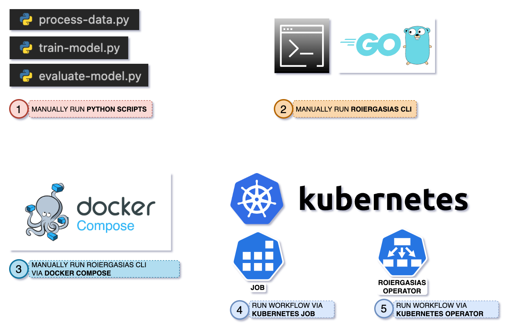
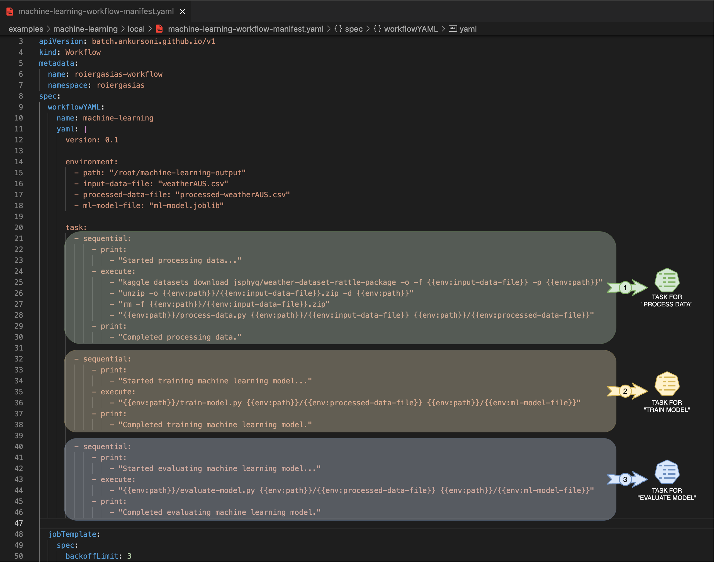
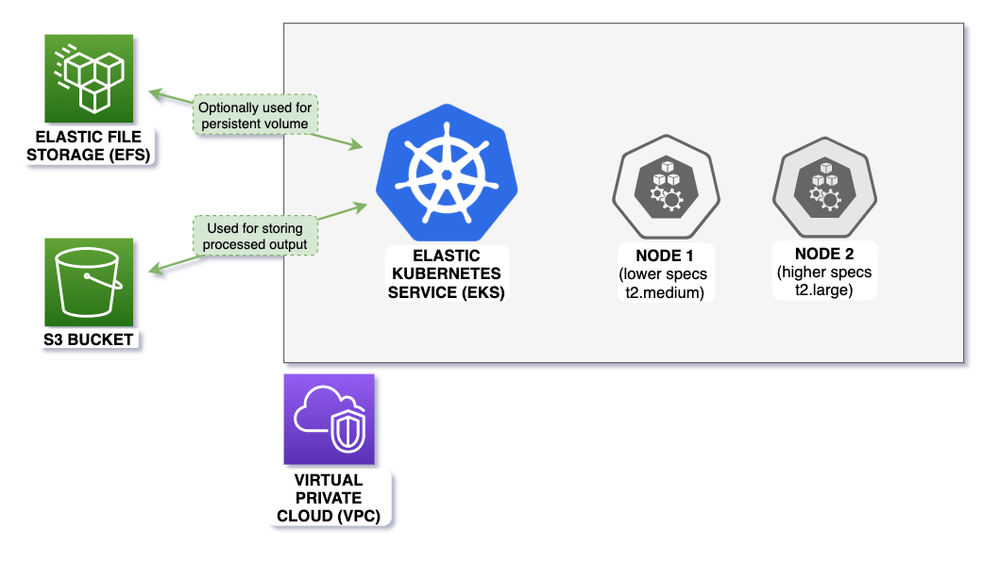

# roi ergasias
> [roí ergasías](https://translate.google.com/?sl=en&tl=el&text=workflow&op=translate) as pronounced in greek means workflow.

This **kubernetes operator** is meant to address a fundamental requirement of any data science / machine learning project 
running their pipelines on Kubernetes - which is to quickly provision a declarative data pipeline (on demand) for their 
various project needs using simple kubectl commands. Basically, implementing the concept of **No Ops**.  
The fundamental principle is to utilise best of docker, kubernetes and programming language features to run a workflow 
with minimal workflow definition syntax.

[](https://pkg.go.dev/github.com/ankursoni/kubernetes-operator-roiergasias)


## Run "Hello world" workflow locally
```shell
# clone to a local git directory, if not already done so
git clone https://github.com/ankursoni/kubernetes-operator-roiergasias.git

# change to the local git directory
cd kubernetes-operator-roiergasias

# set execute permissions to roiergasias cli
chmod +x cmd/linux/roiergasias cmd/osx/roiergasias

# run the hello world workflow
./cmd/linux/roiergasias run -f ./examples/hello-world/hello-world.yaml
# or, for mac osx
./cmd/osx/roiergasias run -f ./examples/hello-world/hello-world.yaml
```
Notice that the environment variables set globally and in previous steps are made available to subsequent steps:  


## Run "Hello world" workflow via operator in Kubernetes
### - Install [Helm](https://helm.sh/docs/intro/install/)
### - For local Kubernetes, install [Kubernetes by Docker Desktop](https://docs.docker.com/desktop/kubernetes/) or [Minikube](https://minikube.sigs.k8s.io/docs/start/)

```shell
# install roiergasias operator
helm install --repo https://github.com/ankursoni/kubernetes-operator-roiergasias/raw/main/operator/helm/ \
  --version v0.1.2 \
  roiergasias-operator roiergasias-operator

# explore the contents of hello-world-kubernetes.yaml file
cat examples/hello-world/hello-world-kubernetes.yaml

# apply the manifest
kubectl apply -f examples/hello-world/hello-world-kubernetes.yaml

# browse workflow created by the manifest
kubectl get workflow
# should display "roiergasias-demo"

# browse configmap created by the workflow
kubectl get configmap
# should display "roiergasias-demo-hello-world"

# browse job created by the workflow
kubectl get job
# should display "roiergasias-demo"

# browse pod created by the job
kubectl get pod
# should display "roiergasias-demo-<STRING>"

# check pod logs for the output and wait till it is completed
kubectl logs roiergasias-demo-<STRING_FROM_PREVIOUS_STEP>

# delete the manifest
kubectl delete -f examples/hello-world/hello-world-kubernetes.yaml

# uninstall the operator (optional)
helm uninstall roiergasias-operator
```
Notice that the workflow yaml file is provided to the pod as a volume - 'yaml' automatically created by the operator using a generated config map:  


## Why use Roiergasias?
The USP (unique selling point) of using Roiergasias workflow in Kubernetes is its ability to split workflow to run in multiple worker nodes as depicted briefly below:  


  
Notice the sequence of actions:
```text
1. Create config map 1 + job 1 for split workflow 1 on "node1"
2. Wait for job 1 to complete
3. Create config map 2 + job 2 for split workflow 2 on "node2"
4. Wait for job 2 to complete
5. Create config map 3 + job 3 for split workflow 3 on "node2"
6. Wait for job 3 to complete  
```
For more details, follow this [README](examples/hello-world/README.md)

---

## Run "Machine learning" workflow locally
  
  
For more details, follow this [README](examples/machine-learning/local/README.md)

---

## Run "Machine learning" workflow in AWS
  
  
Notice the sequence of actions:
```text
1. Create config map 1 + job 1 for split workflow - "process data" on "node1"
2. Wait for job 1 to complete
3. Create config map 2 + job 2 for split workflow - "train model" on "node2"
4. Wait for job 2 to complete
5. Create config map 3 + job 3 for split workflow - "evaluate model" on "node2"
6. Wait for job 3 to complete  
```
For more details, follow this [README](examples/machine-learning/aws/README.md)

---

## Getting started with Roiergasias workflow
Core features of Roiergasias workflow:
1. It is cloud agnostic as it can run in any Kubernetes in cloud or local.  
2. It is also language agnostic as it derives the capabilities of the system where it is running be it container or virtual machine.  

For workflow yaml file syntax and command syntax, follow this [README](cmd/README.md)

---

## Repository map
```text
 📌 -----------------------> you are here
┬
├── cmd    ----------------> contains go main starting point for roiergasias workflow cli
│   ├── linux   -----------> contains linux amd64 executable for roiergasias workflow cli
│   └── osx   -------------> contains mac-osx amd64 executable for roiergasias workflow cli
├── docs   ----------------> contains documentation / images
├── examples  
│   ├── hello-world   -----> contains both single node and multi node split workflow example
│   ├── machine-learning
│   │   ├── aws   ---------> contains multi node split workflow in 2 node groups example
│   │   └── local   -------> contains single node workflow example
├── infra   ---------------> contains terraform scripts for infrastructure as code
│   └── aws
├── operator   ------------> contains kubernetes operator code for roiergasias workflow
│   ├── api
│   ├── config
│   ├── controllers
│   ├── hack
│   └── helm   ------------> contains kubernetes operator helm chart repository
└── pkg   -----------------> contains go packages for roiergasias workflow engine
    ├── lib
    ├── mocks
    ├── steps
    ├── tasks
    └── workflow
```