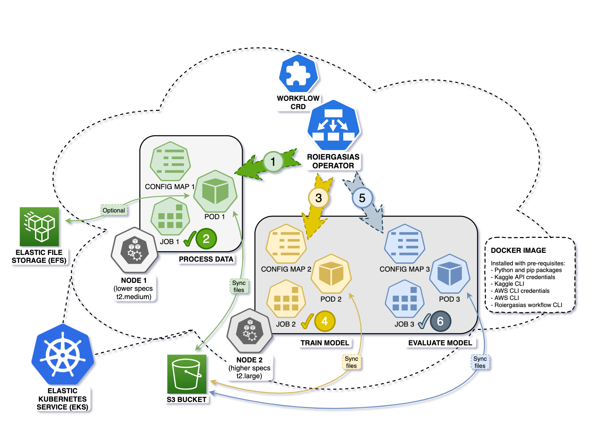

# roi ergasias
> [roí ergasías](https://translate.google.com/?sl=en&tl=el&text=workflow&op=translate) as pronounced in greek means workflow.

This **kubernetes operator** is meant to address a fundamental requirement of any data science / machine learning project running their pipelines on Kubernetes - which is to quickly provision a declarative data pipeline (on demand) for their various project needs using simple kubectl commands. Basically, implementing the concept of **No Ops**.


## Run "Hello world" workflow locally
``` SH
# clone to a local git directory, if not already done so
git clone https://github.com/ankursoni/kubernetes-operator-roiergasias.git

# change to the local git directory
cd kubernetes-operator-roiergasias

# set execute permissions to go main binary
chmod +x cmd/main cmd/main-osx

# run the hello world workflow
./cmd/main ./cmd/hello-world/hello-world.yaml
# or, for mac osx
./cmd/main-osx ./cmd/hello-world/hello-world.yaml
```


## Run "Hello world" workflow via operator in kubernetes
``` SH
# clone to a local git directory, if not already done so
git clone https://github.com/ankursoni/kubernetes-operator-roiergasias.git

# change to the local git directory
cd kubernetes-operator-roiergasias

# install roiergasias operator
helm install --repo https://github.com/ankursoni/kubernetes-operator-roiergasias/raw/main/operator/helm/ \
  --version 0.1.0 \
  roiergasias-operator roiergasias-operator

# write the following yaml file
cat <<EOF> hello-world-manifest.yaml
apiVersion: batch.ankursoni.github.io/v1
kind: Workflow
metadata:
  name: roiergasias-kubernetes
spec:
  workflowYAML:
    name: hello-world-yaml
    yaml: |
      version: 1.0

      environment:
        - welcome: "Welcome to the demo workflow!"

      task:
        - sequential:
          - print:
            - "Hello"
            - "World!"
          - print:
            - "Hi"
            - "Universe!"
            set-environment:
              - greeting: "Warm greetings!"

        - sequential:
          - print:
            - "{{env:welcome}}"
          - print:
            - "{{env:greeting}}"
      
  jobTemplate:
    spec:
      backoffLimit: 3
      template:
        spec:
          imagePullSecrets:
            - name: container-registry-secret
          containers:
            - name: roiergasias
              image: docker.io/ankursoni/roiergasias:aws
              command: ["./cmd/main", "./cmd/hello-world/hello-world-yaml.yaml"]
              env:
              volumeMounts:
                - name: yaml
                  mountPath: /root/cmd/hello-world
              resources:
                requests:
                  memory: "250Mi"
                  cpu: "500m"
                limits:
                  memory: "500Mi"
                  cpu: "1000m"
          restartPolicy: Never
          volumes:
            - name: yaml
              configMap:
                name: roiergasias-kubernetes-hello-world-yaml
EOF

# apply the manifest
kubectl apply -f hello-world-manifest.yaml

# delete the manifest
kubectl delete -f hello-world-manifest.yaml

# uninstall the operator
helm uninstall roiergasias-operator
```


## Run "Machine learning" workflow locally
Follow this [README](cmd/machine-learning/README.md)


## Run "Machine learning" workflow in AWS

Follow this [README](cmd/machine-learning/README.md)


## Install Roiergasias operator
``` SH
# install the operator
helm install --repo https://github.com/ankursoni/kubernetes-operator-roiergasias/raw/main/operator/helm/ \
  --version 0.1.0 \
  roiergasias-operator roiergasias-operator

# uninstall the operator
helm uninstall roiergasias-operator
```