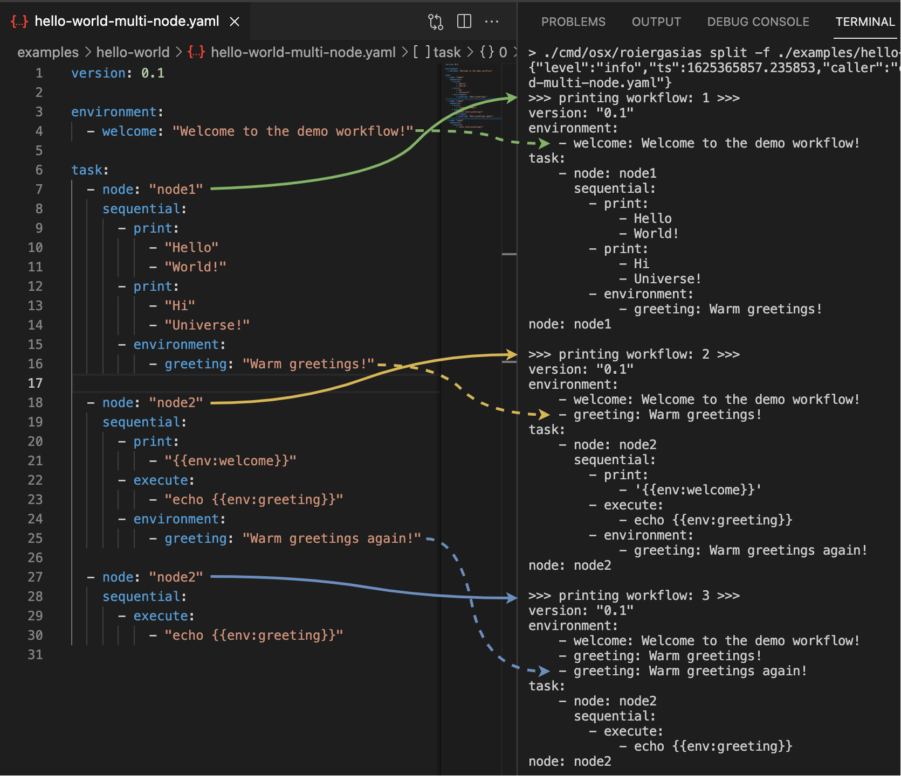
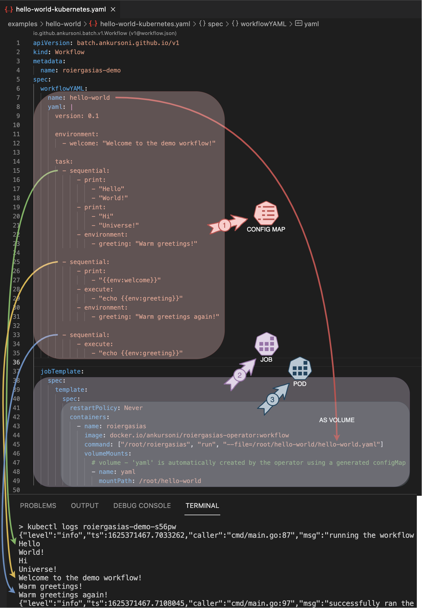

# "Hello world" workflow
The 2 types of examples are:
1. **Single node workflow**:  
   This runs on a single worker node either, locally or in a Kubernetes cluster.  
   Example workflow files are:  
   a. ```hello-world.yaml``` --> to run locally via roiergasias workflow cli  
   b. ```hello-world-kubernetes.yaml``` --> to run on Kubernetes


2. **Multi node workflow**:  
   This runs after splitting its work on multiple worker nodes provided the label on Kubernetes node matches the following format:  
   ```node.roiergasias: "<NODE_LABEL>"```.  
   The environment variables collected from previous tasks are carried forward to subsequent tasks in the split.  
   Example workflow files are:  
   a. ```hello-world-multi-node.yaml``` --> to run locally via roiergasias workflow cli  
   b. ```hello-world-multi-node-kubernetes.yaml``` --> to run on Kubernetes


## Run single node workflow locally
``` SH
# clone to a local git directory, if not already done so
git clone https://github.com/ankursoni/kubernetes-operator-roiergasias.git

# change to the local git directory
cd kubernetes-operator-roiergasias

# set execute permissions to go binary
chmod +x cmd/linux/roiergasias cmd/osx/roiergasias

# run the workflow
./cmd/linux/roiergasias run -f ./examples/hello-world/hello-world.yaml
# or, for mac osx
./cmd/osx/roiergasias run -f ./examples/hello-world/hello-world.yaml
```
Notice that the environment variables set globally and in previous steps are made available to subsequent steps:  


## Test multi node workflow split locally
``` SH
# clone to a local git directory, if not already done so
git clone https://github.com/ankursoni/kubernetes-operator-roiergasias.git

# change to the local git directory
cd kubernetes-operator-roiergasias

# set execute permissions to go binary
chmod +x cmd/linux/roiergasias cmd/osx/roiergasias

# run the workflow
./cmd/linux/roiergasias split -f ./examples/hello-world/hello-world-multi-node.yaml
# or, for mac osx
./cmd/osx/roiergasias split -f ./examples/hello-world/hello-world-multi-node.yaml
```
Notice that the environment variables collected from previous tasks that are carried forward to subsequent tasks in the split represented by dotted arrows:  



## Install pre-requisites for Kubernetes examples
### - Install [Helm](https://helm.sh/docs/intro/install/)
### - For local Kubernetes, install [Kubernetes by Docker Desktop](https://docs.docker.com/desktop/kubernetes/) or [Minikube](https://minikube.sigs.k8s.io/docs/start/)


## Run single node workflow via operator in Kubernetes
``` SH
# clone to a local git directory, if not already done so
git clone https://github.com/ankursoni/kubernetes-operator-roiergasias.git

# change to the local git directory
cd kubernetes-operator-roiergasias

# install roiergasias operator
helm install --repo https://github.com/ankursoni/kubernetes-operator-roiergasias/raw/main/operator/helm/ \
  --version 0.1.1 \
  roiergasias-operator roiergasias-operator

# explore the contents of hello-world-kubernetes.yaml file
cat examples/hello-world/hello-world-kubernetes.yaml

# apply the manifest
kubectl apply -f examples/hello-world/hello-world-kubernetes.yaml

# browse workflow created by the manifest
kubectl get workflow
# should display "roiergasias-demo"

# browse configmap created by the workflow
kubectl get configmap
# should display "roiergasias-demo-hello-world"

# browse job created by the workflow
kubectl get job
# should display "roiergasias-demo"

# browse pod created by the job
kubectl get pod
# should display "roiergasias-demo-<STRING>"

# check pod logs for the output and wait till it is completed
kubectl logs roiergasias-demo-<STRING_FROM_PREVIOUS_STEP>

# delete the manifest
kubectl delete -f examples/hello-world/hello-world-kubernetes.yaml

# uninstall the operator (optional)
helm uninstall roiergasias-operator
```
Notice that the workflow yaml file is provided to the pod as a volume - 'yaml' automatically created by the operator using a generated config map:  



## Run multi node workflow via operator in Kubernetes
``` SH
# clone to a local git directory, if not already done so
git clone https://github.com/ankursoni/kubernetes-operator-roiergasias.git

# change to the local git directory
cd kubernetes-operator-roiergasias

# install roiergasias operator
helm install --repo https://github.com/ankursoni/kubernetes-operator-roiergasias/raw/main/operator/helm/ \
  --version 0.1.1 \
  roiergasias-operator roiergasias-operator

# explore the contents of hello-world-multi-node-kubernetes.yaml file
cat examples/hello-world/hello-world-multi-node-kubernetes.yaml

# label the node to act as "node1" for the first split in the workflow, assuming kubernetes node setup by docker desktop
kubectl label nodes docker-desktop node.roiergasias=node1 --overwrite

# apply the manifest
kubectl apply -f examples/hello-world/hello-world-multi-node-kubernetes.yaml

# browse workflow created by the manifest
kubectl get workflow
# should display "roiergasias-demo"

# browse configmaps created by the workflow
kubectl get configmap
# should display "roiergasias-demo-hello-world-1-node1"
# and "roiergasias-demo-hello-world-2-node2"

# browse jobs created by the workflow
kubectl get job
# should display "roiergasias-demo-1-node1" as active or completed
# and "roiergasias-demo-2-node2" as never completed

# browse pods created by the job
kubectl get pod
# should display "roiergasias-demo-1-node1-<STRING>" as running or completed
# and "roiergasias-demo-2-node2-<STRING>" as pending

# check pod logs for the output and wait till it is completed
kubectl logs roiergasias-demo-1-node1-<STRING_FROM_PREVIOUS_STEP>

# next, label the node to act as "node2" for the subsequent job in the workflow, assuming kubernetes node setup by docker desktop
kubectl label nodes docker-desktop node.roiergasias=node2 --overwrite

# browse configmaps created by the workflow
kubectl get configmap
# should now display "roiergasias-demo-hello-world-1-node1", "roiergasias-demo-hello-world-2-node2" and
# "roiergasias-demo-hello-world-3-node2"

# browse jobs created by the workflow
kubectl get job
# should now display "roiergasias-demo-3-node2" additionally

# browse pods created by the job
kubectl get pod
# should display roiergasias-demo-3-node2-<STRING>" additionally

# check pods' logs for the output and wait till they are completed
kubectl logs roiergasias-demo-2-node2-<STRING_FROM_PREVIOUS_STEP>
kubectl logs roiergasias-demo-3-node2-<STRING_FROM_PREVIOUS_STEP>

# delete the manifest
kubectl delete -f examples/hello-world-multi-node-kubernetes.yaml

# uninstall the operator (optional)
helm uninstall roiergasias-operator
```
