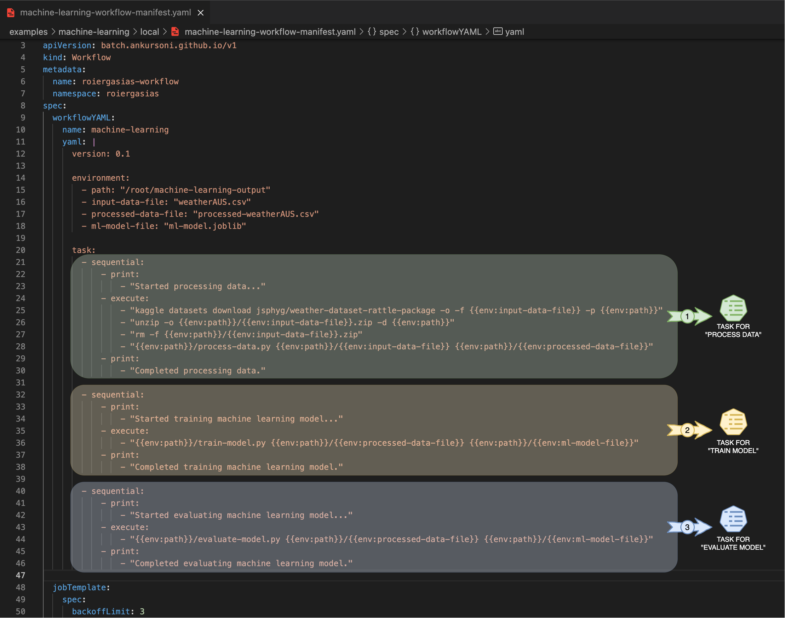

# Process data, train ml model & evaluate ml model locally


## Source of inspiration
Converted the following jupyter notebook to Python scripts:  
https://www.kaggle.com/ilyapozdnyakov/rain-in-australia-precision-recall-curves-viz#Rain-prediction-in-Australia

---

## Install pre-requisites

### - Install [Python 3](https://www.python.org/downloads/)
Also, install the following *pip* packages:
```shell
pip install pandas sklearn joblib
# or,
# pip3 install pandas sklearn joblib
```
### - Install [Kaggle CLI](https://github.com/Kaggle/kaggle-api)
#### -- Make sure kaggle is configured with api key in ~/.kaggle/kaggle.json
#### [Kaggle API Credentials](https://github.com/Kaggle/kaggle-api#api-credentials)
### - For docker runs, install [Docker Desktop](https://www.docker.com/products/docker-desktop) or [Docker](https://docs.docker.com/get-docker/)
### - And, install [Docker Compose](https://docs.docker.com/compose/install/)
### - For local Kubernetes, install [Kubernetes by Docker Desktop](https://docs.docker.com/desktop/kubernetes/) or [Minikube](https://minikube.sigs.k8s.io/docs/start/)
### - Install [Helm](https://helm.sh/docs/intro/install/)
### - Optionally, install [Go](https://golang.org/doc/install)

---


## Index
1. [Manually run python scripts](#1-manually-run-python-scripts)
2. [Manually run roiergasias cli](#2-manually-run-roiergasias-cli)
3. [Manually run roiergasias cli via docker compose](#3-manually-run-roiergasias-cli-via-docker-compose-after-building-docker-image-for-local-as-mentioned-above)
4. [Manually run workflow via Kubernetes job](#4-run-workflow-via-kubernetes-job-after-creating-kubernetes-secret-for-docker-hub-credentials-as-mentioned-above)
5. [Manually run workflow via Kubernetes operator](#5-run-workflow-via-kubernetes-operator-after-pushing-the-docker-image-to-docker-hub-and-creating-kubernetes-secret-for-docker-hub-credentials-as-mentioned-above)

## Clone to a local git directory
```shell
# clone to a local git directory, if not already done so
git clone https://github.com/ankursoni/kubernetes-operator-roiergasias.git
```


## 1. Manually run python scripts
```shell
# change to the local git directory
cd kubernetes-operator-roiergasias

# change to the examples/machine-leaning directory
cd examples/machine-learning/local

# download dataset from kaggle
kaggle datasets download jsphyg/weather-dataset-rattle-package -o -f weatherAUS.csv

# unzip and delete the downloaded zip file
unzip -o weatherAUS.csv.zip
rm -f weatherAUS.csv.zip

# set execute permissions to python script files
chmod +x ./*.py

# process data from first argument file saving output in second argument file
./process-data.py ./weatherAUS.csv ./processed-weatherAUS.csv

# train ml model from first argument file and saving model output in second argument file
./train-model.py ./processed-weatherAUS.csv ./ml-model.joblib

# evaluate ml model by reading processed data and model from first and second argument files
./evaluate-model.py ./processed-weatherAUS.csv ./ml-model.joblib

# check the contents of local directory for output files like weatherAUS.csv, processed-weatherAUS.csv and ml-model.joblib
ls -l

# delete the output files (optional)
rm weatherAUS.csv processed-weatherAUS.csv ml-model.joblib
```


## 2. Manually run roiergasias cli
```shell
# change to the local git directory
cd kubernetes-operator-roiergasias
# or, if coming from previous steps then
cd ../../..

# set execute permissions to roiergasias cli
chmod +x cmd/linux/roiergasias cmd/osx/roiergasias

# run the machine learning workflow
./cmd/linux/roiergasias run -f ./examples/machine-learning/local/machine-learning-manual.yaml
# or, for mac osx
./cmd/osx/roiergasias run -f ./examples/machine-learning/local/machine-learning-manual.yaml

# change to the examples/machine-leaning directory
cd examples/machine-learning/local

# check the contents of local directory for output files like weatherAUS.csv, processed-weatherAUS.csv and ml-model.joblib
ls -l

# delete the output files (optional)
rm weatherAUS.csv processed-weatherAUS.csv ml-model.joblib
```
Input
  
Output
  


## Build docker image for local
```shell
# change to the local git directory
cd kubernetes-operator-roiergasias
# or, if coming from previous steps then
cd ../../..

# copy kaggle api credentials from ~/.kaggle
cp ~/.kaggle/kaggle.json cmd/

# set execute permissions to roiergasias cli
chmod +x cmd/linux/roiergasias cmd/osx/roiergasias

# build docker image
docker build -t roiergasias:local -f cmd/Dockerfile-local cmd
```


## 3. Manually run roiergasias cli via docker compose (after building docker image for local as mentioned above)
```shell
# change to the local git directory
cd kubernetes-operator-roiergasias

# change to the examples/machine-leaning/local directory
cd examples/machine-learning/local

# run docker compose and wait till it is completed
docker-compose up

# check the contents of local directory for output files like weatherAUS.csv, processed-weatherAUS.csv and ml-model.joblib
ls -l

# clean up docker compose
docker-compose down

# delete the output files (optional)
rm weatherAUS.csv processed-weatherAUS.csv ml-model.joblib
```


## Push docker image for local to docker hub (after building docker image for local as mentioned above)
```shell
# re-tag local docker image
docker tag roiergasias:local docker.io/<REPOSITORY>/roiergasias:local
# where, <REPOSITORY> is the docker hub repository name or docker hub username, for e.g.,
# docker tag roiergasias:local docker.io/ankursoni/roiergasias:local

# login to docker hub
docker login

# push the docker image to docker hub
docker push docker.io/<REPOSITORY>/roiergasias:local
# where, <REPOSITORY> is the docker hub repository name or docker hub username, for e.g.,
# docker push docker.io/ankursoni/roiergasias:local
```
> NOTE: Make sure you have changed the above mentioned docker hub repository as **private** because it contains your kaggle api key credentials


## Create Kubernetes secret for docker hub credentials (after pushing docker image to docker hub as mentioned above)
```shell
# create docker hub registry credentials (for pulling docker image pushed previously)
helm upgrade -i --repo https://gabibbo97.github.io/charts imagepullsecrets imagepullsecrets \
  --version 3.0.0 \
  --create-namespace -n roiergasias \
  --set imagePullSecret.registryURL="docker.io" \
  --set imagePullSecret.secretName="container-registry-secret" \
  --set imagePullSecret.username="<USERNAME>" \
  --set imagePullSecret.password="<PASSWORD>"
# where, <USERNAME> and <PASSWORD> are the credentials for login to docker hub
```


## 4. Run workflow via Kubernetes job (after creating kubernetes secret for docker hub credentials as mentioned above)
```shell
# change to the local git directory
cd kubernetes-operator-roiergasias
# or, if coming from previous steps then
cd ../../..

# change to the examples/machine-leaning/local directory
cd examples/machine-learning/local

# create a new helm chart values override file: ./helm/roiergasias-job/values-secret.yaml
cp ./helm/roiergasias-job/values.yaml ./helm/roiergasias-job/values-secret.yaml

# update the values in ./helm/roiergasias-job/values-secret.yaml using nano or vi editor
nano ./helm/roiergasias-job/values-secret.yaml
# update "image" to be "docker.io/<REPOSITORY>/roiergasias:local"
#   where, <REPOSITORY> is the docker hub repository name or docker hub username, for e.g.,
#          "docker.io/ankursoni/roiergasias:local"
# update "hostPath" to be the full path of the local git clone directory + "/examples/machine-learning/local", for e.g.,
#   "/Users/ankursoni/go/src/github.com/ankursoni/kubernetes-operator-roiergasias/examples/machine-learning/local"

# output helm chart template for roiergasias job
helm template \
  -n roiergasias \
  -f ./helm/roiergasias-job/values-secret.yaml \
  roiergasias-job ./helm/roiergasias-job >machine-learning-job-manifest.yaml

# explore the contents of the machine-learning-job-manifest.yaml
cat machine-learning-job-manifest.yaml

# apply the manifest
kubectl apply -f machine-learning-job-manifest.yaml

# browse job created by the manifest
kubectl get job -n roiergasias

# browse pod created by the job
kubectl get pod -n roiergasias

# check pod logs for the output and wait till it is completed
kubectl logs roiergasias-job-<STRING_FROM_PREVIOUS_STEP> -n roiergasias

# check the contents of local directory for output files like weatherAUS.csv, processed-weatherAUS.csv and ml-model.joblib
ls -l

# delete the manifest
kubectl delete -f machine-learning-job-manifest.yaml
rm machine-learning-job-manifest.yaml

# delete the output files (optional)
rm weatherAUS.csv processed-weatherAUS.csv ml-model.joblib
```


## 5. Run workflow via Kubernetes operator (after pushing the docker image to docker hub and creating kubernetes secret for docker hub credentials as mentioned above)
```shell
# change to the local git directory
cd kubernetes-operator-roiergasias
# or, if coming from previous steps then
cd ../../..

# install the operator
helm install --repo https://github.com/ankursoni/kubernetes-operator-roiergasias/raw/main/operator/helm/ \
  --version v0.1.1 \
  roiergasias-operator roiergasias-operator

# change to the examples/machine-leaning/local directory
cd examples/machine-learning/local

# create a new helm chart values override file: ./helm/roiergasias-workflow/values-secret.yaml
cp ./helm/roiergasias-workflow/values.yaml ./helm/roiergasias-workflow/values-secret.yaml

# update the values in ./helm/roiergasias-workflow/values-secret.yaml using nano or vi editor
nano ./helm/roiergasias-workflow/values-secret.yaml
# update "image" to be "docker.io/<REPOSITORY>/roiergasias:local"
#   where, <REPOSITORY> is the docker hub repository name or docker hub username, for e.g.,
#          "docker.io/ankursoni/roiergasias:local"
# update "hostPath" to be the full path of the local git clone directory + "/examples/machine-learning/local", for e.g.,
#   "/Users/ankursoni/go/src/github.com/ankursoni/kubernetes-operator-roiergasias/examples/machine-learning/local"

# output helm chart template for roiergasias workflow
helm template \
  -n roiergasias \
  -f ./helm/roiergasias-workflow/values-secret.yaml \
  roiergasias-workflow ./helm/roiergasias-workflow >machine-learning-workflow-manifest.yaml

# explore the contents of the machine-learning-workflow-manifest.yaml
cat machine-learning-workflow-manifest.yaml

# apply the manifest
kubectl apply -f machine-learning-workflow-manifest.yaml

# browse workflow created by the manifest
kubectl get workflow -n roiergasias

# browse job created by the workflow
kubectl get job -n roiergasias

# browse pod created by the job
kubectl get pod -n roiergasias

# check pod logs for the output and wait till it is completed
kubectl logs roiergasias-workflow-<STRING_FROM_PREVIOUS_STEP> -n roiergasias

# check the contents of local directory for output files like weatherAUS.csv, processed-weatherAUS.csv and ml-model.joblib
ls -l

# delete the manifest
kubectl delete -f machine-learning-workflow-manifest.yaml
rm machine-learning-workflow-manifest.yaml

# delete the output files (optional)
rm weatherAUS.csv processed-weatherAUS.csv ml-model.joblib

# uninstall the operator (optional)
helm uninstall roiergasias-operator

# return to the local git directory
cd ../../..
```
  
